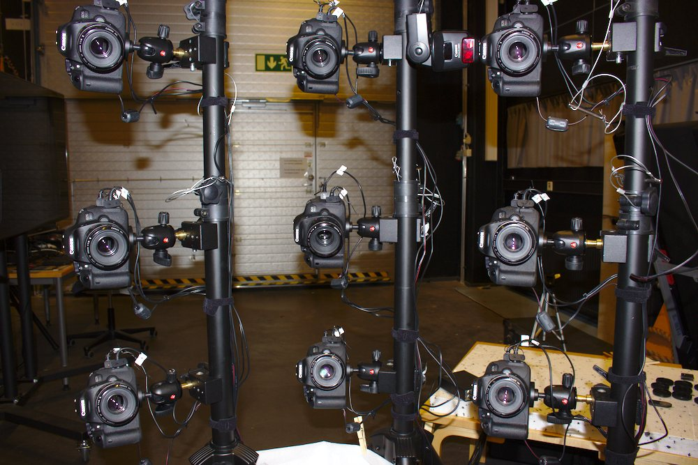
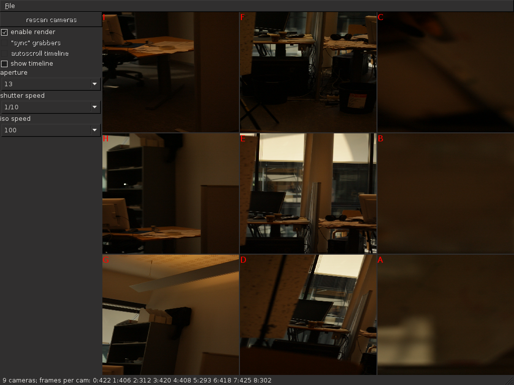
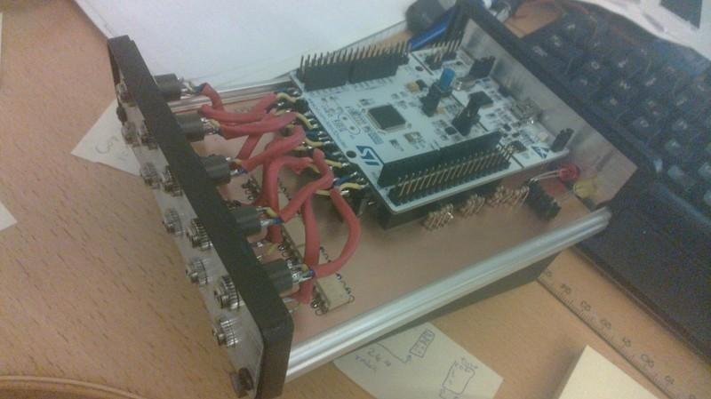

Multi-view stereo reconstruction for computer graphics content capture
======================================================================

Hello, this is my master's thesis work titled as above, and contains both the thesis text itself and some source code and electrical schematics developed during the work in Aalto University in 2014-2015.
For the occasional gibberish, consult a Finnish dictionary.
The technical "multi-view stereo reconstruction" is sometimes called "3D scanning": digitizing real-life object geometry from multiple photographs.
The practical work in this thesis was about building a rig for that purpose.
No reconstruction programs were written, unfortunately.
Try e.g. VisualSFM_ and MeshLab_ for that.

.. _VisualSFM: http://ccwu.me/vsfm/
.. _MeshLab: http://meshlab.sourceforge.net/

.. image:: latex/gfx/bitmap/horsereconst.jpg
   :width: 500px
   :alt: horse mask rendering

Code
----

The thesis talks also about the background math, but the only code here is for controlling DSLRs remotely using gPhoto2_ in C++ and some shell scripts.
The tools were only tested using nine Canon EOS 700D cameras; no guarantees are given for others, but not much major changes are expected to be required.
I forgot to run valgrind on the final tool, so expect no warranty in memory leaks or any other errors.

.. _gPhoto2: http://gphoto.org/

The code here represents a prototype only, but it works for what was required, it's just not very polished.
I wrote a C++ wrapper for gphoto that is unimaginatively called *gpwrap*.
A preview tool (*gphotogrid*) downloads a live stream from each camera in parallel and allows the user to configure their parameters (aperture and such), with no significant performance optimizations or anything, as it's just a proof of concept.
The wrapper and the grid have been tested to work in recent versions of Linux and Mac OS X using the EOS 700Ds, but YMMV.
A more polished tool called `CaptureQuick`_ is developed on top of it by Daniel Thul; if you are going to use the wrapper for developing your own programs, or want the grid tool, look there too.
CaptureQuick still uses the wrapper written by me with only minor modifications (as of June 2015).
Expect it to grow further.

.. _CaptureQuick: https://github.com/dthul/capture-quick

Electronics
-----------

I built a simple remote tool for controlling the shutters of the nine cameras via a single usb-serial connection, in `arbitrary order`_ (typically simultaneously, though).
The control output goes directly to the 700Ds' shutter release inputs (a 2.5mm stereo jack).
The box has also a button for human interaction, and it's based on Nucleo-F401RE_, a simple STM32 board.
The schematics and the PCB are in EAGLE_ 7.0.0 format.
I named the thing *camsremote*.
No warranty.

.. _arbitrary order: https://www.youtube.com/watch?v=bDDnQzyOaFg
.. _Nucleo-F401RE: http://www.st.com/nucleoF401RE-pr
.. _EAGLE: http://www.cadsoftusa.com/eagle-pcb-design-software/

Abstract
--------

Rendering of photorealistic models is becoming increasingly feasible and important in computer graphics.
Due to the high amount of work in creating such models by hand, required by the need of high level of detail in geometry, colors, and animation, it is desirable to automate the model creation.
This task is realised by recovering content from photographs that describe the modeled subject from multiple viewpoints.
In this thesis, elementary theory on image acquisition and photograph-based reconstruction of geometry and colors is studied and recent research and software for graphics content reconstruction are reviewed.
Based on the studied background, a rig is built as a grid of nine off-the-shelf digital cameras, a custom remote shutter trigger, and supporting software.
The purpose of the rig is to capture high-quality photographs and video in a reliable and practical manner, to be processed in multi-view reconstruction programs.

The camera rig was configured to shoot small static subjects for experiments.
The resulting photos and video were then processed directly for the subject's geometry and color, with little or no image enhancements done.
Two typical reconstruction software pipelines were described and tested.
The rig was found to perform well for several subjects with little subject-specific tuning;
issues in the setup were analyzed and further improvements suggested based on the captured test models.
Image quality of the cameras was found to be excellent for the task, and most problems arose from uneven lighting and practical issues.
The developed rig was found to produce sub-millimeter scale accuracy in geometry and texture of subjects such as human faces.
Future work was suggested for lighting, video synchronization and study of state-of-the-art image processing and reconstruction algorithms.

